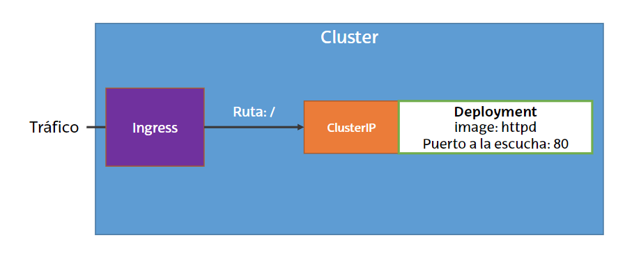

# Ejercicio 1

## Configurar Kubernetes para que ejecute un servidor web Apache usando los siguientes objetos



## Crear los objetos necesarios

### 1 objeto Deployment

#### Réplicas: 1

#### Imagen: httpd

```yml
apiVersion: apps/v1
kind: Deployment
metadata:
  name: mi-deployment
spec:
  replicas: 1
  selector:
    matchLabels:
      modulo: servidor-web
  template:
    metadata:
      labels:
        modulo: servidor-web
    spec: 
      containers:
      - name: mi-pod
        image: httpd
        ports:
        - containerPort: 80
```

```bash
kubectl apply -f mi-deployment.yml
```

### 1 objeto ClusterIP

```yml
apiVersion: v1
kind: Service
metadata:
  modulo: servidor-web
spec:
  type: ClusterIP
  selector:
    modulo: servidor-web
  ports:
  - port: 80
    targetPort: 80
```

```bash
kubectl apply -f mi-clusterip.yml
```

### 1 objeto Ingress

#### Definir 1 regla de Ingress para redirigir el tráfico

#### La creación en GKE puede llevar varios minutos

```yml
apiVersion: networking.k8s.io/v1
kind: Ingress
metadata:
  name: mi-ingress
spec:
  rules:
  - http:
    paths:
      - path: /*
        pathType: ImplementationSpecific
        backend:
          service:
            modulo: servidor-web
            port:
              number: 80
```

```bash
kubectl apply -f mi-ingress.yml
```

## Verificar con un navegador que el despliegue funciona

```bash
kubectl get Ingress

firefox http://<ip>
```
