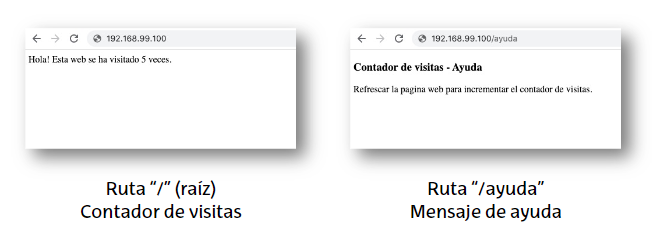
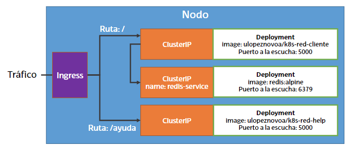

# Ejercicio 2

## Configurar un despliegue que sirva las 2 siguientes páginas web



## La estructura del despliegue es la siguiente

### Se deben respetar los nombres y números de puerto escritos en el diagrama



## Crear los objetos necesarios

### 3 objetos Deployment

#### Replicas: 1 (en cada Deployment)

#### Ver las imágenes en el diagrama anterior

```yml
apiVersion: apps/v1
kind: Deployment
metadata:
  name: deployment1
spec:
  replicas: 1
  selector:
    matchLabels:
      modulo: deployment1
  template:
    metadata:
      labels:
        modulo: deployment1
    spec: 
      containers:
      - name: pod1
        image: ulopeznovoa/k8s-red-cliente
        ports:
        - containerPort: 5000
```

```yml
apiVersion: apps/v1
kind: Deployment
metadata:
  name: deployment2
spec:
  replicas: 1
  selector:
    matchLabels:
      modulo: deployment2
  template:
    metadata:
      labels:
        modulo: deployment2
    spec: 
      containers:
      - name: pod2
        image: redis:alpine
        ports:
        - containerPort: 6379
```

```yml
apiVersion: apps/v1
kind: Deployment
metadata:
  name: deployment3
spec:
  replicas: 1
  selector:
    matchLabels:
      modulo: deployment3
  template:
    metadata:
      labels:
        modulo: deployment3
    spec: 
      containers:
      - name: pod3
        image: ulopeznovoa/k8s-red-help
        ports:
        - containerPort: 5000
```

```bash
kubectl apply -f deployment.yml
```

### 3 objetos ClusterIP

```yml
apiVersion: v1
kind: Service
metadata:
  name: cluster1
spec:
  type: ClusterIP
  selector:
    modulo: deployment1
  ports:
  - port: 80
    targetPort: 5000
```
  
```yml
apiVersion: v1
kind: Service
metadata:
  name: redis-service
spec:
  type: ClusterIP
  selector:
    modulo: deployment2
  ports:
  - port: 6379
    targetPort: 6379
```

```yml
apiVersion: v1
kind: Service
metadata:
  name: cluster3
spec:
  type: ClusterIP
  selector:
    modulo: deployment3
  ports:
  - port: 80
    targetPort: 5000
```

```bash
kubectl apply -f clusterip.yml
```

### 1 objeto Ingress

#### Definir reglas de Ingress para redirigir

##### La ruta “/” al Deployment con “ulopeznovoa/k8s-red-cliente”

##### La ruta ”/ayuda” al Deployment con “ulopeznovoa/k8s-red-help”

#### La creación en GKE puede llevar varios minutos

```yml
apiVersion: networking.k8s.io/v1
kind: Ingress
metadata:
  name: mi-ingress
spec:
  rules:
  - http:
      paths:
      - path: /
        pathType: Prefix
        backend:
          service:
            name: cluster1
            port:
              number: 80
      - path: /ayuda/
        pathType: Prefix
        backend:
          service:
            name: cluster3
            port:
              number: 80
```

```bash
kubectl apply -f ingress.yml
```

## Verificar con un navegador que el despliegue funciona
